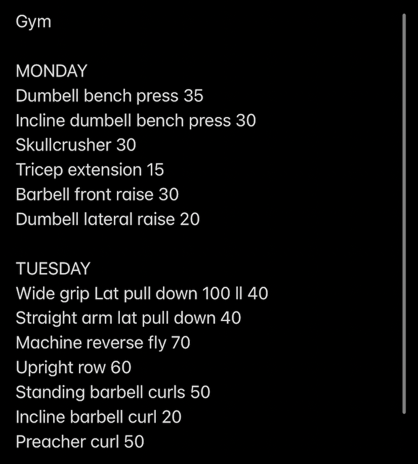
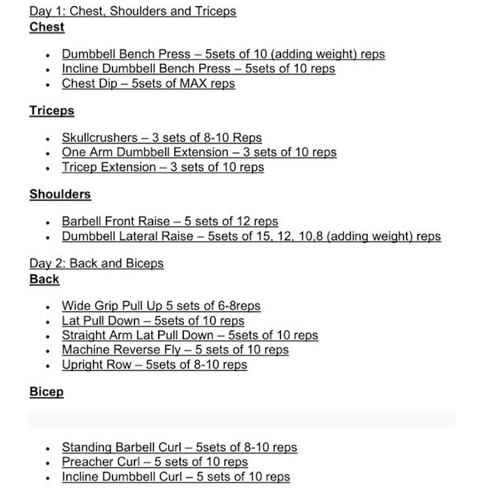
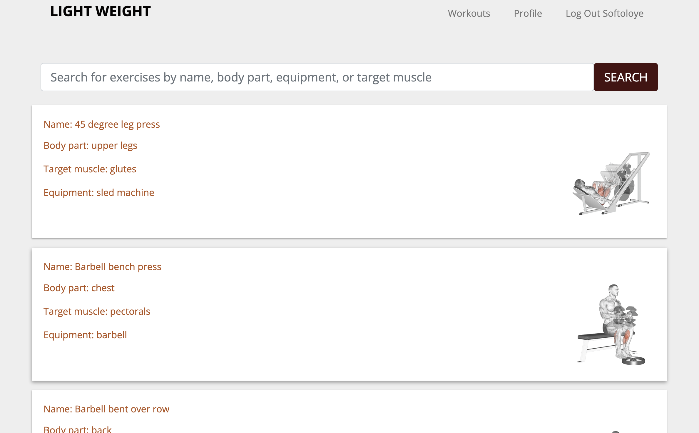
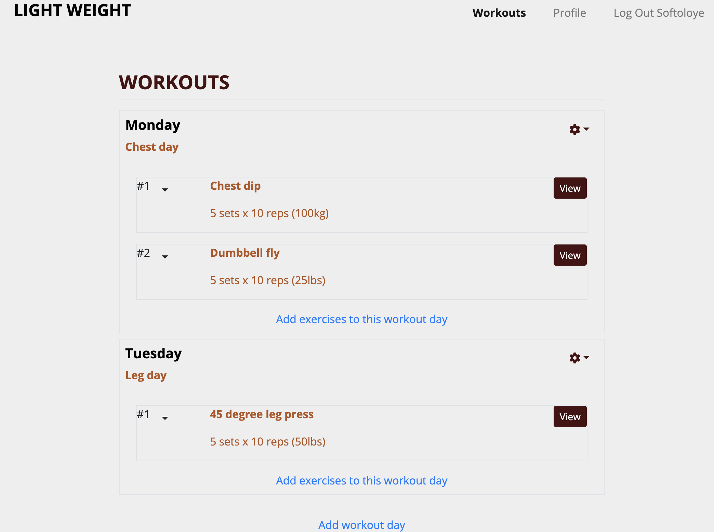
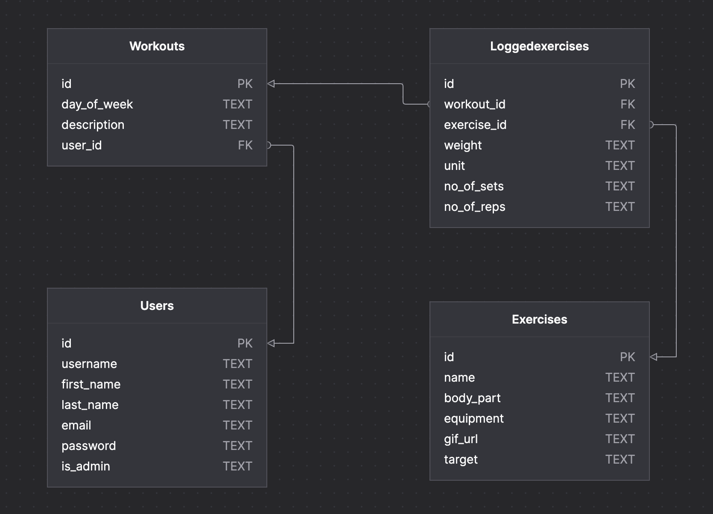

# Light Weight

**Website URL**:https://soggy-queen.surge.sh/

Light Weight is a full-stack database-driven website for searching and planning of workouts by users.
Before now, my daily exercises were saved as screenshots on my phone, and the weights I exercised with were typed on the notes app on my phone.

 

The API for this website - that provides exercises for users to choose from - was built by me from scratch using Node JS. The information on the API were gotten from [ExerciseDB](https://rapidapi.com/justin-WFnsXH_t6/api/exercisedb/), and [Wger.de](https://wger.de/en/workout/overview) was used as an inspiration for the building of the user interface.

## What Light Weight does?

On Light Weight, users can search and select from the list of exercises provided by the backend, and add them to their daily workout routines. The weight, sets, and reps at which the exercises are performed are also added by the user.

|  |
| :------------------------------------------------------------------------: |
|                  _Exercises search page on Light Weight_                   |

|  |
| :-----------------------------------------------------: |
|             _Workouts page on Light Weight_             |

## Application features

- Views: Home, workouts, exercise list, exercise
- users panel: add/view/edit/delete exercises and workouts

## Technologies used

- PostgreSQL
- Express
- Node
- React

## Libraries

- react-bootstrap for styling
- jwt web token/bcrypt for authentication - custom middleware to protect routes

## API

- [Light Weight API](https://lightweight-backend.herokuapp.com/)

## Deployment

- Backend and Frontend: heroku

## Database schema

- A postgreSQL database is used to implement the database schema. The database schema is made up of 4 tables: user, workouts, exercises, and loggedexercises.
- The relationships between these tables are shown on the image below.

## Getting started

- Clone this repository with `git clone https://github.com/promisethedeveloper/lightweight`
- Run `cd lightweight-backend` and run `npm install` to install all backend dependencies
- Run `npm start` to start the backend
- Run `cd..`
- Run `cd lightweight-frontend` and run `npm install` to install the frontend dependencies
- Run `npm start` to start the frontend
  Once you have completed the steps above, you will have a ready-to-go copy of Light Weight on your local machine.

## Backend testing with jest

- Navigate to `lightweight/lightweight-backend`
- Run in terminal:
  `npm run test`

## Restful API routes

- The server is started on http://localhost:3001 and all the routes are listed below

| HTTP Verb |            Route             |         Meaning          |
| :-------: | :--------------------------: | :----------------------: |
|   POST    |         /auth/token          |   Authentication User    |
|   POST    |        /auth/register        |      Register User       |
|   POST    |          /exercises          | Create exercises (Admin) |
|    GET    |          /exercises          |    Find all exercises    |
|    GET    |      /exercises/[name]       |       Get exercise       |
|   PATCH   |      /exercises/[name]       | Update exercise (Admin)  |
|  DELETE   |      /exercises/[name]       | Delete exercises (Admin) |
|   POST    |       /loggedexercise        |     Log an exercise      |
|    GET    | /loggedexercise/[workout_Id] |   Get logged exercise    |
|   PATCH   |     /loggedexercise/[id]     |  Update logged exercise  |
|  DELETE   |     /loggedexercise/[id]     |  Delete logged exercise  |
|   POST    |            /users            |   Create User (Admin)    |
|    GET    |            /users            |  Get all Users (Admin)   |
|    GET    |      /users/[username]       |         Get User         |
|   PATCH   |      /users /[username]      |       Update User        |
|  DELETE   |      /users/[username]       |       Delete User        |
|   POST    |       /workouts/[day]        |      Create workout      |
|    GET    |          /workouts           |     Get all workouts     |
|    GET    |     /workouts/[username]     |       Get workout        |
|   PATCH   |       /workouts/[day]        |      Update workout      |
|  DELETE   |       /workouts/[day]        |      Delete workout      |

## Frontend testing with react testing library

- Navigate to `lightweight/lightweight-frontend`
- Run in terminal:
  `npm run test`

## Frontend components

|             |
| :-----------------------------------------------------------------: |
| _Diagrammatic representation of Light Weight components and states_ |
